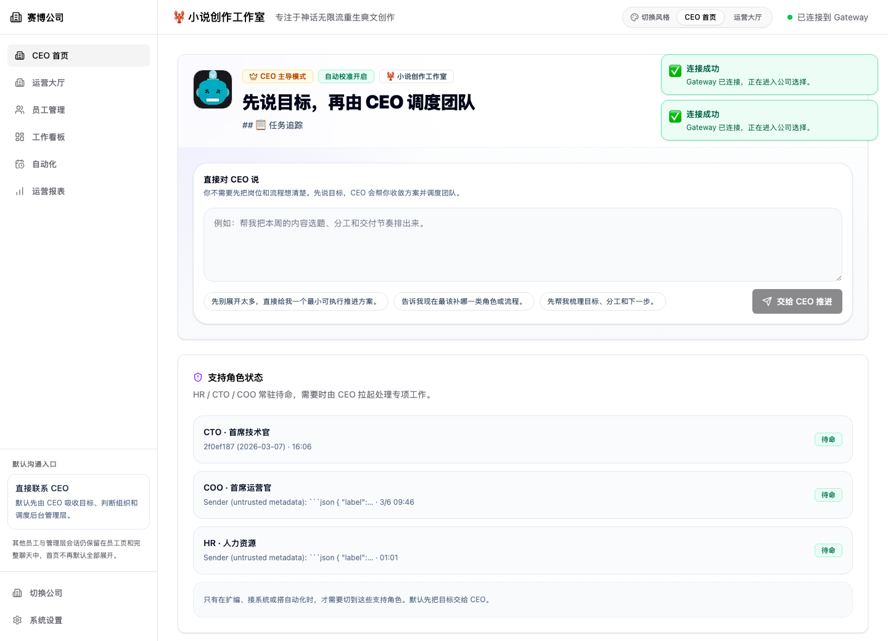
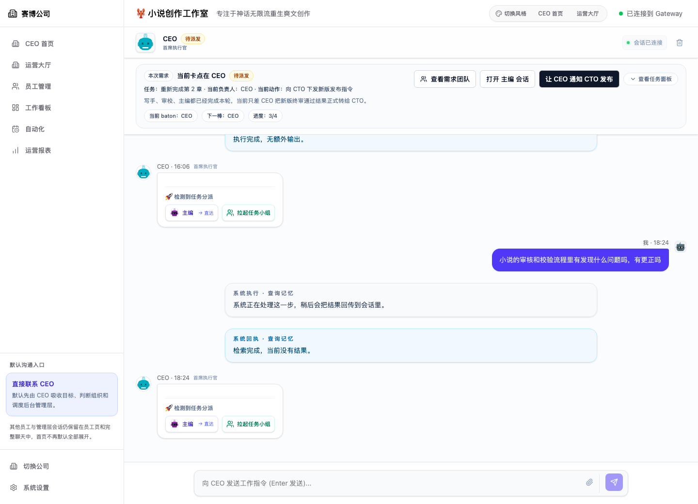
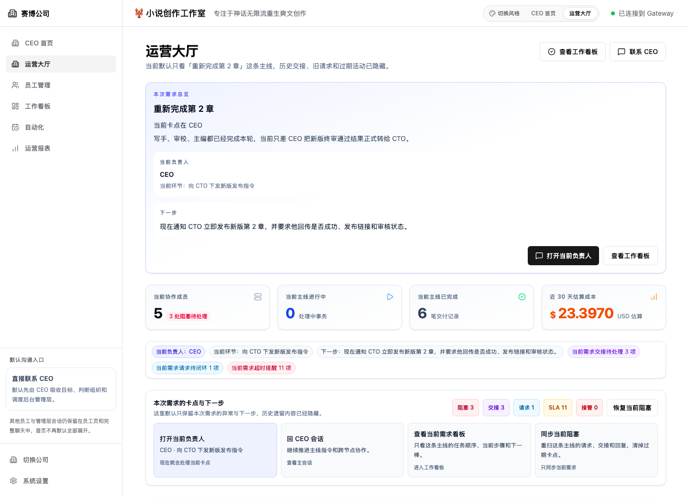
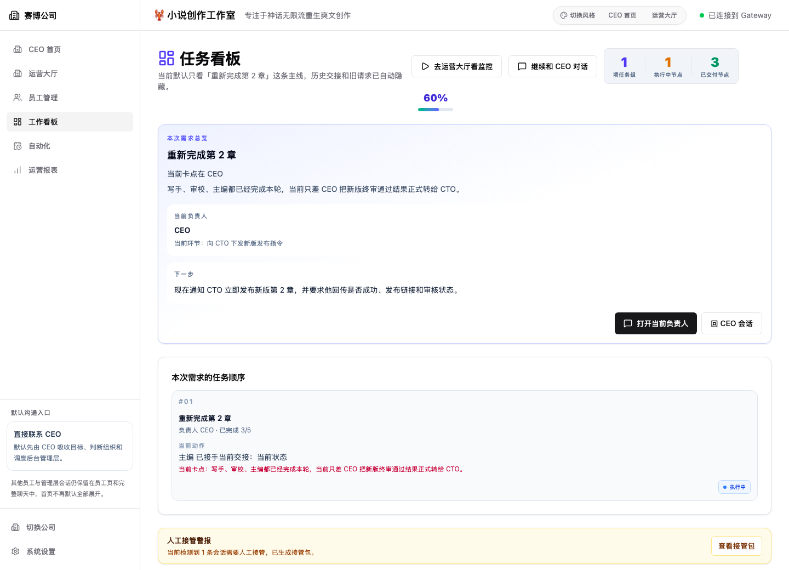

# Claw Sims / Claw Company

[English](./README.en.md) | [简体中文](./README.md)

`Claw Sims` is a simulation universe built on top of OpenClaw. This repository currently hosts its first playable subset, `Claw Company`: a company sim where a single operator runs an AI team through CEO coordination, requirement flow, collaboration, takeover, recovery, and governance surfaces.

It is not just another chat wrapper. The product turns org structure, requests, handoffs, blockers, approvals, automation, and delivery evidence into explicit state so that "simulated work" becomes operable, traceable, and recoverable.

## Brand Structure

- `Claw Sims`
  The umbrella world and long-term product direction. More playable subsets can grow under it later, including life, work, and system simulations.
- `Claw Company`
  The first mainline product in this repository and the currently playable slice. Its focus is company operations, CEO-led coordination, requirement execution, and collaboration governance.
- `OpenClaw`
  The runtime, Gateway, and underlying agent capabilities.

> Note: the repository name and some historical docs still use `cyber-company`, but the outward-facing product story is now converging on `Claw Sims -> Claw Company -> OpenClaw`.

## What This Repository Currently Supports

- `Connect and bootstrap`: `/connect`, `/select`, `/create`, `/executor-setup`
- `Runtime`: `/runtime` for authority, executor, recovery, and compatibility diagnostics
- `CEO Home`: `/ceo` to start from goals and let the CEO coordinate the team
- `Requirement Center`: `/requirement` for the mainline requirement, decisions, acceptance, and progress
- `Ops`: `/ops` for blockers, takeovers, recovery actions, and team activity
- `Board`: `/board` for execution order, dispatch, ownership, and execution summaries
- `Workspace`: `/workspace` for deliverables, knowledge capture, and closeout evidence
- `Employees`: `/employees`
- `Automation`: `/automation`
- `Dashboard`: `/dashboard`
- `Settings`: `/settings`
- `Actor chat`: `/chat/:agentId`

The default `/` entry redirects to `/runtime` after connection and company recovery, then the top mainline switch can take you into `CEO Home` or the `Requirement Center`.

## Quick Start

### Prerequisites

- Node.js 22+
- An accessible OpenClaw Gateway

### Install

```bash
npm install
npm run dev
```

`npm run dev` starts both the Vite frontend and the local Authority control plane.

Open `http://localhost:5173`, connect to the Authority, then create or select a company.

If you also run OpenClaw locally, the Authority will try to connect to `ws://localhost:18789` as its downstream executor. If that executor is not available, the UI still loads, but chat and model-backed capabilities will show a degraded status.

## How To Read This Repository

If this is your first time in the codebase, use this order:

1. `docs/engineering-onboarding.md`
2. `src/App.tsx`
3. Route entry components in `src/pages/*`
4. Screens, hooks, and page assembly in `src/presentation/*`
5. Facades, commands, queries, and orchestration in `src/application/*`
6. Pure rules in `src/domain/*`, and Gateway / runtime / persistence code in `src/infrastructure/*`

## Architecture Layers

- `src/pages`
  Route entry layer. Each file only binds a URL to a screen.
- `src/presentation`
  Screens, UI-level hooks, view-models, and page assembly logic.
- `src/application`
  Query/command facades, orchestration, and cross-domain read models consumed by pages.
- `src/domain`
  Pure types, domain rules, and event semantics with no presentation or infrastructure dependency.
- `src/infrastructure`
  Gateway, runtime stores, persistence, event logs, and other external adapters.
- `src/components`
  Reusable UI and system hosts such as toasts, approval modals, and banners.
- `src/lib`
  Small helpers; new business-critical flows should not live here.

## Repository Conventions

- Do not add new `src/features/*` modules. That legacy layer is retired.
- For page behavior, follow `pages -> presentation -> application -> domain/infrastructure`.
- Before adding a rule, decide whether it belongs to pure business semantics or page/external integration.
- When in doubt, check the "where changes belong" section in `docs/engineering-onboarding.md`.

## Development

```bash
npm run dev
npm run build
npm run lint -- --max-warnings=0
npm test
```

## Docs

- `docs/engineering-onboarding.md`
  Entry points, brand structure, and the current directory map.
- `docs/cyber-company-evolution-direction.md`
  How the current `Claw Company` slice can evolve into a broader `Claw Sims` product surface.
- `docs/cyber-company-prd.md`
  Product background, problem framing, and requirement drafts for the current company-sim slice.
- `docs/codex-for-oss-application.md`
  External application material draft.
- `docs/archive/ddd-boundary-migration/`
  Historical planning, progress, and archive records from the 2026-03 DDD consolidation work. Not the current development entry point.

## Screenshots

### CEO Home



### CEO Chat



### Ops



### Board


